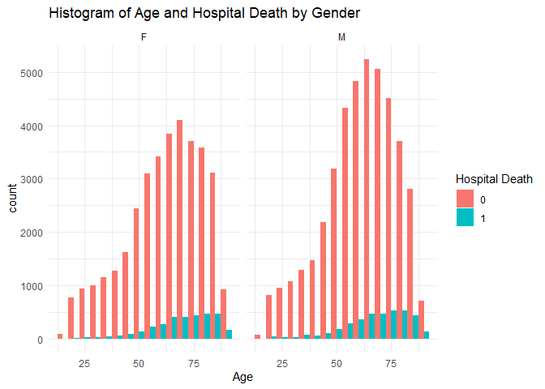
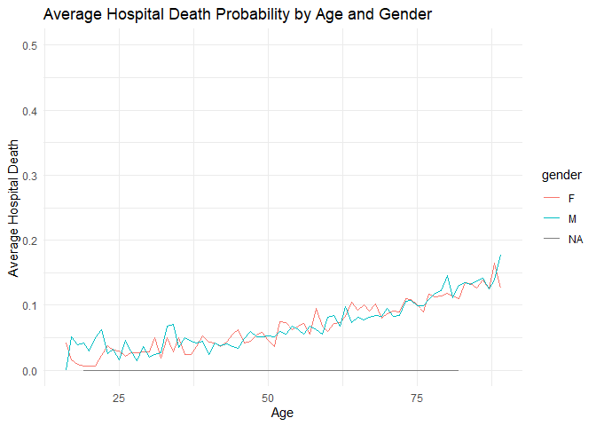
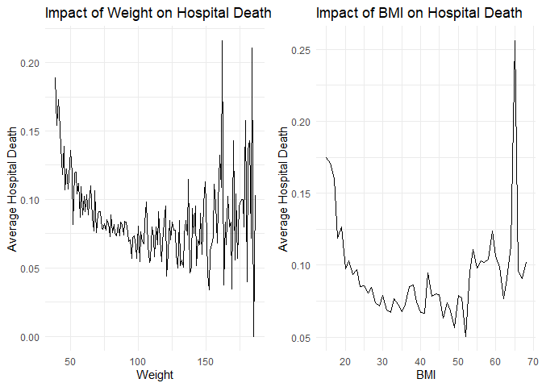
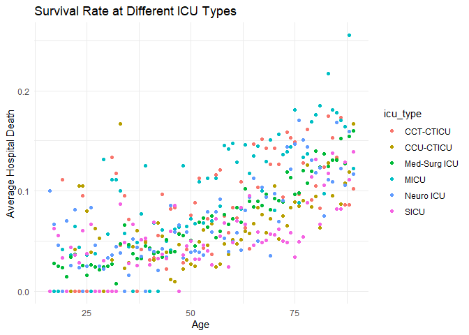
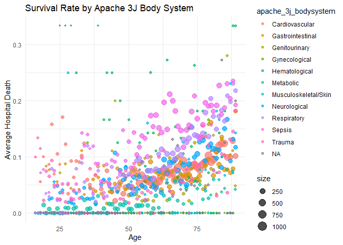

Hospital Data Analysis and Modeling
================
Islam
June 12, 2022

``` r
knitr::opts_chunk$set(fig.path='Figs/')
```

## Introduction

In this analysis, we will explore hospital data, focusing on patient
characteristics and outcomes such as survival rates. We will also build
a machine learning model to predict hospital death based on various
features.

## Step 1: Data Loading

``` r
# Load data
data <- read_csv("dataset.csv")
```

    ## New names:
    ## Rows: 91713 Columns: 85
    ## -- Column specification
    ## -------------------------------------------------------- Delimiter: "," chr
    ## (7): ethnicity, gender, icu_admit_source, icu_stay_type, icu_type, apac... dbl
    ## (77): encounter_id, patient_id, hospital_id, age, bmi, elective_surgery,... lgl
    ## (1): ...84
    ## i Use `spec()` to retrieve the full column specification for this data. i
    ## Specify the column types or set `show_col_types = FALSE` to quiet this message.
    ## * `` -> `...84`

``` r
# Inspect the structure of the data
glimpse(data)
```

    ## Rows: 91,713
    ## Columns: 85
    ## $ encounter_id                  <dbl> 66154, 114252, 119783, 79267, 92056, 331~
    ## $ patient_id                    <dbl> 25312, 59342, 50777, 46918, 34377, 74489~
    ## $ hospital_id                   <dbl> 118, 81, 118, 118, 33, 83, 83, 33, 118, ~
    ## $ age                           <dbl> 68, 77, 25, 81, 19, 67, 59, 70, 45, 50, ~
    ## $ bmi                           <dbl> 22.73000, 27.42000, 31.95000, 22.64000, ~
    ## $ elective_surgery              <dbl> 0, 0, 0, 1, 0, 0, 0, 0, 0, 0, 1, 1, 0, 1~
    ## $ ethnicity                     <chr> "Caucasian", "Caucasian", "Caucasian", "~
    ## $ gender                        <chr> "M", "F", "F", "F", "M", "M", "F", "M", ~
    ## $ height                        <dbl> 180.3, 160.0, 172.7, 165.1, 188.0, 190.5~
    ## $ icu_admit_source              <chr> "Floor", "Floor", "Accident & Emergency"~
    ## $ icu_id                        <dbl> 92, 90, 93, 92, 91, 95, 95, 91, 114, 114~
    ## $ icu_stay_type                 <chr> "admit", "admit", "admit", "admit", "adm~
    ## $ icu_type                      <chr> "CTICU", "Med-Surg ICU", "Med-Surg ICU",~
    ## $ pre_icu_los_days              <dbl> 0.541666667, 0.927777778, 0.000694444, 0~
    ## $ weight                        <dbl> 73.9, 70.2, 95.3, 61.7, NA, 100.0, 156.6~
    ## $ apache_2_diagnosis            <dbl> 113, 108, 122, 203, 119, 301, 108, 113, ~
    ## $ apache_3j_diagnosis           <dbl> 502.01, 203.01, 703.03, 1206.03, 601.01,~
    ## $ apache_post_operative         <dbl> 0, 0, 0, 1, 0, 0, 0, 0, 0, 0, 1, 1, 0, 1~
    ## $ arf_apache                    <dbl> 0, 0, 0, 0, 0, 0, 0, 0, 0, 0, 0, 0, 0, 0~
    ## $ gcs_eyes_apache               <dbl> 3, 1, 3, 4, NA, 4, 4, 4, 4, 4, 4, 4, 4, ~
    ## $ gcs_motor_apache              <dbl> 6, 3, 6, 6, NA, 6, 6, 6, 6, 6, 6, 6, 6, ~
    ## $ gcs_unable_apache             <dbl> 0, 0, 0, 0, NA, 0, 0, 0, 0, 0, 0, 0, 0, ~
    ## $ gcs_verbal_apache             <dbl> 4, 1, 5, 5, NA, 5, 5, 5, 5, 5, 5, 4, 5, ~
    ## $ heart_rate_apache             <dbl> 118, 120, 102, 114, 60, 113, 133, 120, 8~
    ## $ intubated_apache              <dbl> 0, 0, 0, 1, 0, 0, 1, 0, 0, 0, 0, 0, 0, 0~
    ## $ map_apache                    <dbl> 40, 46, 68, 60, 103, 130, 138, 60, 66, 5~
    ## $ resprate_apache               <dbl> 36, 33, 37, 4, 16, 35, 53, 28, 14, 46, 1~
    ## $ temp_apache                   <dbl> 39.3, 35.1, 36.7, 34.8, 36.7, 36.6, 35.0~
    ## $ ventilated_apache             <dbl> 0, 1, 0, 1, 0, 0, 1, 1, 1, 0, 0, 0, 0, 0~
    ## $ d1_diasbp_max                 <dbl> 68, 95, 88, 48, 99, 100, 76, 84, 65, 83,~
    ## $ d1_diasbp_min                 <dbl> 37, 31, 48, 42, 57, 61, 68, 46, 59, 48, ~
    ## $ d1_diasbp_noninvasive_max     <dbl> 68, 95, 88, 48, 99, 100, 76, 84, 65, 83,~
    ## $ d1_diasbp_noninvasive_min     <dbl> 37, 31, 48, 42, 57, 61, 68, 46, 59, 48, ~
    ## $ d1_heartrate_max              <dbl> 119, 118, 96, 116, 89, 113, 112, 118, 82~
    ## $ d1_heartrate_min              <dbl> 72, 72, 68, 92, 60, 83, 70, 86, 82, 57, ~
    ## $ d1_mbp_max                    <dbl> 89, 120, 102, 84, 104, 127, 117, 114, 93~
    ## $ d1_mbp_min                    <dbl> 46, 38, 68, 84, 90, 80, 97, 60, 71, 59, ~
    ## $ d1_mbp_noninvasive_max        <dbl> 89, 120, 102, 84, 104, 127, 117, 114, 93~
    ## $ d1_mbp_noninvasive_min        <dbl> 46, 38, 68, 84, 90, 80, 97, 60, 71, 59, ~
    ## $ d1_resprate_max               <dbl> 34, 32, 21, 23, 18, 32, 38, 28, 24, 44, ~
    ## $ d1_resprate_min               <dbl> 10, 12, 8, 7, 16, 10, 16, 12, 19, 14, 14~
    ## $ d1_spo2_max                   <dbl> 100, 100, 98, 100, 100, 97, 100, 100, 97~
    ## $ d1_spo2_min                   <dbl> 74, 70, 91, 95, 96, 91, 87, 92, 97, 96, ~
    ## $ d1_sysbp_max                  <dbl> 131, 159, 148, 158, 147, 173, 151, 147, ~
    ## $ d1_sysbp_min                  <dbl> 73, 67, 105, 84, 120, 107, 133, 71, 98, ~
    ## $ d1_sysbp_noninvasive_max      <dbl> 131, 159, 148, 158, 147, 173, 151, 147, ~
    ## $ d1_sysbp_noninvasive_min      <dbl> 73, 67, 105, 84, 120, 107, 133, 71, 98, ~
    ## $ d1_temp_max                   <dbl> 39.9, 36.3, 37.0, 38.0, 37.2, 36.8, 37.2~
    ## $ d1_temp_min                   <dbl> 37.2, 35.1, 36.7, 34.8, 36.7, 36.6, 35.0~
    ## $ h1_diasbp_max                 <dbl> 68, 61, 88, 62, 99, 89, 107, 74, 65, 83,~
    ## $ h1_diasbp_min                 <dbl> 63, 48, 58, 44, 68, 89, 79, 55, 59, 61, ~
    ## $ h1_diasbp_noninvasive_max     <dbl> 68, 61, 88, NA, 99, 89, NA, 74, 65, 83, ~
    ## $ h1_diasbp_noninvasive_min     <dbl> 63, 48, 58, NA, 68, 89, NA, 55, 59, 61, ~
    ## $ h1_heartrate_max              <dbl> 119, 114, 96, 100, 89, 83, 79, 118, 82, ~
    ## $ h1_heartrate_min              <dbl> 108, 100, 78, 96, 76, 83, 72, 114, 82, 6~
    ## $ h1_mbp_max                    <dbl> 86, 85, 91, 92, 104, 111, 117, 88, 93, 1~
    ## $ h1_mbp_min                    <dbl> 85, 57, 83, 71, 92, 111, 117, 60, 71, 77~
    ## $ h1_mbp_noninvasive_max        <dbl> 86, 85, 91, NA, 104, 111, 117, 88, 93, 1~
    ## $ h1_mbp_noninvasive_min        <dbl> 85, 57, 83, NA, 92, 111, 117, 60, 71, 77~
    ## $ h1_resprate_max               <dbl> 26, 31, 20, 12, NA, 12, 18, 28, 24, 29, ~
    ## $ h1_resprate_min               <dbl> 18, 28, 16, 11, NA, 12, 18, 26, 19, 17, ~
    ## $ h1_spo2_max                   <dbl> 100, 95, 98, 100, 100, 97, 100, 96, 97, ~
    ## $ h1_spo2_min                   <dbl> 74, 70, 91, 99, 100, 97, 100, 92, 97, 96~
    ## $ h1_sysbp_max                  <dbl> 131, 95, 148, 136, 130, 143, 191, 119, 1~
    ## $ h1_sysbp_min                  <dbl> 115, 71, 124, 106, 120, 143, 163, 106, 9~
    ## $ h1_sysbp_noninvasive_max      <dbl> 131, 95, 148, NA, 130, 143, NA, 119, 104~
    ## $ h1_sysbp_noninvasive_min      <dbl> 115, 71, 124, NA, 120, 143, NA, 106, 98,~
    ## $ d1_glucose_max                <dbl> 168, 145, NA, 185, NA, 156, 197, 129, 36~
    ## $ d1_glucose_min                <dbl> 109, 128, NA, 88, NA, 125, 129, 129, 288~
    ## $ d1_potassium_max              <dbl> 4.0, 4.2, NA, 5.0, NA, 3.9, 5.0, 5.8, 5.~
    ## $ d1_potassium_min              <dbl> 3.4, 3.8, NA, 3.5, NA, 3.7, 4.2, 2.4, 5.~
    ## $ apache_4a_hospital_death_prob <dbl> 0.10, 0.47, 0.00, 0.04, NA, 0.05, 0.10, ~
    ## $ apache_4a_icu_death_prob      <dbl> 0.05, 0.29, 0.00, 0.03, NA, 0.02, 0.05, ~
    ## $ aids                          <dbl> 0, 0, 0, 0, 0, 0, 0, 0, 0, 0, 0, 0, 0, 0~
    ## $ cirrhosis                     <dbl> 0, 0, 0, 0, 0, 0, 0, 0, 0, 0, 0, 0, 0, 0~
    ## $ diabetes_mellitus             <dbl> 1, 1, 0, 0, 0, 1, 1, 0, 0, 0, 0, 0, 0, 0~
    ## $ hepatic_failure               <dbl> 0, 0, 0, 0, 0, 0, 0, 0, 0, 0, 0, 0, 0, 0~
    ## $ immunosuppression             <dbl> 0, 0, 0, 0, 0, 0, 0, 1, 0, 0, 1, 0, 0, 0~
    ## $ leukemia                      <dbl> 0, 0, 0, 0, 0, 0, 0, 0, 0, 0, 0, 1, 0, 0~
    ## $ lymphoma                      <dbl> 0, 0, 0, 0, 0, 0, 0, 0, 0, 0, 0, 0, 0, 0~
    ## $ solid_tumor_with_metastasis   <dbl> 0, 0, 0, 0, 0, 0, 0, 0, 0, 0, 0, 0, 0, 0~
    ## $ apache_3j_bodysystem          <chr> "Sepsis", "Respiratory", "Metabolic", "C~
    ## $ apache_2_bodysystem           <chr> "Cardiovascular", "Respiratory", "Metabo~
    ## $ ...84                         <lgl> NA, NA, NA, NA, NA, NA, NA, NA, NA, NA, ~
    ## $ hospital_death                <dbl> 0, 0, 0, 0, 0, 0, 0, 0, 1, 0, 0, 0, 0, 0~

``` r
summary(data)
```

    ##   encounter_id      patient_id      hospital_id         age       
    ##  Min.   :     1   Min.   :     1   Min.   :  2.0   Min.   :16.00  
    ##  1st Qu.: 32852   1st Qu.: 32830   1st Qu.: 47.0   1st Qu.:52.00  
    ##  Median : 65665   Median : 65413   Median :109.0   Median :65.00  
    ##  Mean   : 65606   Mean   : 65537   Mean   :105.7   Mean   :62.31  
    ##  3rd Qu.: 98342   3rd Qu.: 98298   3rd Qu.:161.0   3rd Qu.:75.00  
    ##  Max.   :131051   Max.   :131051   Max.   :204.0   Max.   :89.00  
    ##                                                    NA's   :4228   
    ##       bmi        elective_surgery  ethnicity            gender         
    ##  Min.   :14.85   Min.   :0.0000   Length:91713       Length:91713      
    ##  1st Qu.:23.64   1st Qu.:0.0000   Class :character   Class :character  
    ##  Median :27.66   Median :0.0000   Mode  :character   Mode  :character  
    ##  Mean   :29.19   Mean   :0.1837                                        
    ##  3rd Qu.:32.93   3rd Qu.:0.0000                                        
    ##  Max.   :67.81   Max.   :1.0000                                        
    ##  NA's   :3429                                                          
    ##      height      icu_admit_source       icu_id      icu_stay_type     
    ##  Min.   :137.2   Length:91713       Min.   : 82.0   Length:91713      
    ##  1st Qu.:162.5   Class :character   1st Qu.:369.0   Class :character  
    ##  Median :170.1   Mode  :character   Median :504.0   Mode  :character  
    ##  Mean   :169.6                      Mean   :508.4                     
    ##  3rd Qu.:177.8                      3rd Qu.:679.0                     
    ##  Max.   :195.6                      Max.   :927.0                     
    ##  NA's   :1334                                                         
    ##    icu_type         pre_icu_los_days        weight       apache_2_diagnosis
    ##  Length:91713       Min.   :-24.94722   Min.   : 38.60   Min.   :101.0     
    ##  Class :character   1st Qu.:  0.03542   1st Qu.: 66.80   1st Qu.:113.0     
    ##  Mode  :character   Median :  0.13889   Median : 80.30   Median :122.0     
    ##                     Mean   :  0.83577   Mean   : 84.03   Mean   :185.4     
    ##                     3rd Qu.:  0.40903   3rd Qu.: 97.10   3rd Qu.:301.0     
    ##                     Max.   :159.09097   Max.   :186.00   Max.   :308.0     
    ##                                         NA's   :2720     NA's   :1662      
    ##  apache_3j_diagnosis apache_post_operative   arf_apache    gcs_eyes_apache
    ##  Min.   :   0.01     Min.   :0.0000        Min.   :0.000   Min.   :1.000  
    ##  1st Qu.: 203.01     1st Qu.:0.0000        1st Qu.:0.000   1st Qu.:3.000  
    ##  Median : 409.02     Median :0.0000        Median :0.000   Median :4.000  
    ##  Mean   : 558.22     Mean   :0.2011        Mean   :0.028   Mean   :3.465  
    ##  3rd Qu.: 703.03     3rd Qu.:0.0000        3rd Qu.:0.000   3rd Qu.:4.000  
    ##  Max.   :2201.05     Max.   :1.0000        Max.   :1.000   Max.   :4.000  
    ##  NA's   :1101                              NA's   :715     NA's   :1901   
    ##  gcs_motor_apache gcs_unable_apache gcs_verbal_apache heart_rate_apache
    ##  Min.   :1.000    Min.   :0.0000    Min.   :1.000     Min.   : 30.00   
    ##  1st Qu.:6.000    1st Qu.:0.0000    1st Qu.:4.000     1st Qu.: 86.00   
    ##  Median :6.000    Median :0.0000    Median :5.000     Median :104.00   
    ##  Mean   :5.471    Mean   :0.0095    Mean   :3.995     Mean   : 99.71   
    ##  3rd Qu.:6.000    3rd Qu.:0.0000    3rd Qu.:5.000     3rd Qu.:120.00   
    ##  Max.   :6.000    Max.   :1.0000    Max.   :5.000     Max.   :178.00   
    ##  NA's   :1901     NA's   :1037      NA's   :1901      NA's   :878      
    ##  intubated_apache   map_apache     resprate_apache  temp_apache   
    ##  Min.   :0.0000   Min.   : 40.00   Min.   : 4.00   Min.   :32.10  
    ##  1st Qu.:0.0000   1st Qu.: 54.00   1st Qu.:11.00   1st Qu.:36.20  
    ##  Median :0.0000   Median : 67.00   Median :28.00   Median :36.50  
    ##  Mean   :0.1512   Mean   : 88.02   Mean   :25.81   Mean   :36.41  
    ##  3rd Qu.:0.0000   3rd Qu.:125.00   3rd Qu.:36.00   3rd Qu.:36.70  
    ##  Max.   :1.0000   Max.   :200.00   Max.   :60.00   Max.   :39.70  
    ##  NA's   :715      NA's   :994      NA's   :1234    NA's   :4108   
    ##  ventilated_apache d1_diasbp_max    d1_diasbp_min   d1_diasbp_noninvasive_max
    ##  Min.   :0.0000    Min.   : 46.00   Min.   :13.00   Min.   : 46.00           
    ##  1st Qu.:0.0000    1st Qu.: 75.00   1st Qu.:42.00   1st Qu.: 75.00           
    ##  Median :0.0000    Median : 86.00   Median :50.00   Median : 87.00           
    ##  Mean   :0.3257    Mean   : 88.49   Mean   :50.16   Mean   : 88.61           
    ##  3rd Qu.:1.0000    3rd Qu.: 99.00   3rd Qu.:58.00   3rd Qu.: 99.00           
    ##  Max.   :1.0000    Max.   :165.00   Max.   :90.00   Max.   :165.00           
    ##  NA's   :715       NA's   :165      NA's   :165     NA's   :1040             
    ##  d1_diasbp_noninvasive_min d1_heartrate_max d1_heartrate_min   d1_mbp_max   
    ##  Min.   :13.00             Min.   : 58      Min.   :  0.00   Min.   : 60.0  
    ##  1st Qu.:42.00             1st Qu.: 87      1st Qu.: 60.00   1st Qu.: 90.0  
    ##  Median :50.00             Median :101      Median : 69.00   Median :102.0  
    ##  Mean   :50.24             Mean   :103      Mean   : 70.32   Mean   :104.7  
    ##  3rd Qu.:58.00             3rd Qu.:116      3rd Qu.: 81.00   3rd Qu.:116.0  
    ##  Max.   :90.00             Max.   :177      Max.   :175.00   Max.   :184.0  
    ##  NA's   :1040              NA's   :145      NA's   :145      NA's   :220    
    ##    d1_mbp_min     d1_mbp_noninvasive_max d1_mbp_noninvasive_min d1_resprate_max
    ##  Min.   : 22.00   Min.   : 60.0          Min.   : 22.00         Min.   :14.00  
    ##  1st Qu.: 55.00   1st Qu.: 90.0          1st Qu.: 55.00         1st Qu.:22.00  
    ##  Median : 64.00   Median :102.0          Median : 64.00         Median :26.00  
    ##  Mean   : 64.87   Mean   :104.6          Mean   : 64.94         Mean   :28.88  
    ##  3rd Qu.: 75.00   3rd Qu.:116.0          3rd Qu.: 75.00         3rd Qu.:32.00  
    ##  Max.   :112.00   Max.   :181.0          Max.   :112.00         Max.   :92.00  
    ##  NA's   :220      NA's   :1479           NA's   :1479           NA's   :385    
    ##  d1_resprate_min   d1_spo2_max      d1_spo2_min      d1_sysbp_max  
    ##  Min.   :  0.00   Min.   :  0.00   Min.   :  0.00   Min.   : 90.0  
    ##  1st Qu.: 10.00   1st Qu.: 99.00   1st Qu.: 89.00   1st Qu.:130.0  
    ##  Median : 13.00   Median :100.00   Median : 92.00   Median :146.0  
    ##  Mean   : 12.85   Mean   : 99.24   Mean   : 90.45   Mean   :148.3  
    ##  3rd Qu.: 16.00   3rd Qu.:100.00   3rd Qu.: 95.00   3rd Qu.:164.0  
    ##  Max.   :100.00   Max.   :100.00   Max.   :100.00   Max.   :232.0  
    ##  NA's   :385      NA's   :333      NA's   :333      NA's   :159    
    ##   d1_sysbp_min    d1_sysbp_noninvasive_max d1_sysbp_noninvasive_min
    ##  Min.   : 41.00   Min.   : 90.0            Min.   : 41.03          
    ##  1st Qu.: 83.00   1st Qu.:130.0            1st Qu.: 84.00          
    ##  Median : 96.00   Median :146.0            Median : 96.00          
    ##  Mean   : 96.92   Mean   :148.2            Mean   : 96.99          
    ##  3rd Qu.:110.00   3rd Qu.:164.0            3rd Qu.:110.00          
    ##  Max.   :160.00   Max.   :232.0            Max.   :160.00          
    ##  NA's   :159      NA's   :1027             NA's   :1027            
    ##   d1_temp_max     d1_temp_min    h1_diasbp_max    h1_diasbp_min   
    ##  Min.   :35.10   Min.   :31.89   Min.   : 37.00   Min.   : 22.00  
    ##  1st Qu.:36.90   1st Qu.:36.10   1st Qu.: 62.00   1st Qu.: 52.00  
    ##  Median :37.11   Median :36.40   Median : 74.00   Median : 62.00  
    ##  Mean   :37.28   Mean   :36.27   Mean   : 75.36   Mean   : 62.84  
    ##  3rd Qu.:37.60   3rd Qu.:36.66   3rd Qu.: 86.00   3rd Qu.: 73.00  
    ##  Max.   :39.90   Max.   :37.80   Max.   :143.00   Max.   :113.00  
    ##  NA's   :2324    NA's   :2324    NA's   :3619     NA's   :3619    
    ##  h1_diasbp_noninvasive_max h1_diasbp_noninvasive_min h1_heartrate_max
    ##  Min.   : 37.00            Min.   : 22.00            Min.   : 46.00  
    ##  1st Qu.: 63.00            1st Qu.: 52.00            1st Qu.: 77.00  
    ##  Median : 74.00            Median : 62.00            Median : 90.00  
    ##  Mean   : 75.81            Mean   : 63.27            Mean   : 92.23  
    ##  3rd Qu.: 87.00            3rd Qu.: 74.00            3rd Qu.:106.00  
    ##  Max.   :144.00            Max.   :114.00            Max.   :164.00  
    ##  NA's   :7350              NA's   :7350              NA's   :2790    
    ##  h1_heartrate_min   h1_mbp_max       h1_mbp_min    h1_mbp_noninvasive_max
    ##  Min.   : 36.00   Min.   : 49.00   Min.   : 32.0   Min.   : 49.00        
    ##  1st Qu.: 69.00   1st Qu.: 77.00   1st Qu.: 66.0   1st Qu.: 77.00        
    ##  Median : 82.00   Median : 90.00   Median : 78.0   Median : 90.00        
    ##  Mean   : 83.66   Mean   : 91.61   Mean   : 79.4   Mean   : 91.59        
    ##  3rd Qu.: 97.00   3rd Qu.:104.00   3rd Qu.: 92.0   3rd Qu.:104.00        
    ##  Max.   :144.00   Max.   :165.00   Max.   :138.0   Max.   :163.00        
    ##  NA's   :2790     NA's   :4639     NA's   :4639    NA's   :9084          
    ##  h1_mbp_noninvasive_min h1_resprate_max h1_resprate_min   h1_spo2_max    
    ##  Min.   : 32.00         Min.   :10.00   Min.   :  0.00   Min.   :  0.00  
    ##  1st Qu.: 66.00         1st Qu.:18.00   1st Qu.: 14.00   1st Qu.: 97.00  
    ##  Median : 79.00         Median :21.00   Median : 16.00   Median : 99.00  
    ##  Mean   : 79.71         Mean   :22.63   Mean   : 17.21   Mean   : 98.05  
    ##  3rd Qu.: 92.00         3rd Qu.:26.00   3rd Qu.: 20.00   3rd Qu.:100.00  
    ##  Max.   :138.00         Max.   :59.00   Max.   :189.00   Max.   :100.00  
    ##  NA's   :9084           NA's   :4357    NA's   :4357     NA's   :4185    
    ##   h1_spo2_min      h1_sysbp_max    h1_sysbp_min   h1_sysbp_noninvasive_max
    ##  Min.   :  0.00   Min.   : 75.0   Min.   : 53.0   Min.   : 75.0           
    ##  1st Qu.: 94.00   1st Qu.:113.0   1st Qu.: 98.0   1st Qu.:113.0           
    ##  Median : 96.00   Median :131.0   Median :115.0   Median :130.0           
    ##  Mean   : 95.17   Mean   :133.2   Mean   :116.4   Mean   :133.1           
    ##  3rd Qu.: 99.00   3rd Qu.:150.0   3rd Qu.:134.0   3rd Qu.:150.0           
    ##  Max.   :100.00   Max.   :223.0   Max.   :194.0   Max.   :223.0           
    ##  NA's   :4185     NA's   :3611    NA's   :3611    NA's   :7341            
    ##  h1_sysbp_noninvasive_min d1_glucose_max  d1_glucose_min  d1_potassium_max
    ##  Min.   : 53.0            Min.   : 73.0   Min.   : 33.0   Min.   :2.800   
    ##  1st Qu.: 98.0            1st Qu.:117.0   1st Qu.: 91.0   1st Qu.:3.800   
    ##  Median :115.0            Median :150.0   Median :107.0   Median :4.200   
    ##  Mean   :116.5            Mean   :174.6   Mean   :114.4   Mean   :4.252   
    ##  3rd Qu.:134.0            3rd Qu.:201.0   3rd Qu.:131.0   3rd Qu.:4.600   
    ##  Max.   :195.0            Max.   :611.0   Max.   :288.0   Max.   :7.000   
    ##  NA's   :7341             NA's   :5807    NA's   :5807    NA's   :9585    
    ##  d1_potassium_min apache_4a_hospital_death_prob apache_4a_icu_death_prob
    ##  Min.   :2.400    Min.   :-1.000                Min.   :-1.000          
    ##  1st Qu.:3.600    1st Qu.: 0.020                1st Qu.: 0.010          
    ##  Median :3.900    Median : 0.050                Median : 0.020          
    ##  Mean   :3.935    Mean   : 0.087                Mean   : 0.044          
    ##  3rd Qu.:4.300    3rd Qu.: 0.130                3rd Qu.: 0.060          
    ##  Max.   :5.800    Max.   : 0.990                Max.   : 0.970          
    ##  NA's   :9585     NA's   :7947                  NA's   :7947            
    ##       aids         cirrhosis      diabetes_mellitus hepatic_failure
    ##  Min.   :0e+00   Min.   :0.0000   Min.   :0.0000    Min.   :0.000  
    ##  1st Qu.:0e+00   1st Qu.:0.0000   1st Qu.:0.0000    1st Qu.:0.000  
    ##  Median :0e+00   Median :0.0000   Median :0.0000    Median :0.000  
    ##  Mean   :9e-04   Mean   :0.0157   Mean   :0.2252    Mean   :0.013  
    ##  3rd Qu.:0e+00   3rd Qu.:0.0000   3rd Qu.:0.0000    3rd Qu.:0.000  
    ##  Max.   :1e+00   Max.   :1.0000   Max.   :1.0000    Max.   :1.000  
    ##  NA's   :715     NA's   :715      NA's   :715       NA's   :715    
    ##  immunosuppression    leukemia         lymphoma     
    ##  Min.   :0.0000    Min.   :0.0000   Min.   :0.0000  
    ##  1st Qu.:0.0000    1st Qu.:0.0000   1st Qu.:0.0000  
    ##  Median :0.0000    Median :0.0000   Median :0.0000  
    ##  Mean   :0.0262    Mean   :0.0071   Mean   :0.0041  
    ##  3rd Qu.:0.0000    3rd Qu.:0.0000   3rd Qu.:0.0000  
    ##  Max.   :1.0000    Max.   :1.0000   Max.   :1.0000  
    ##  NA's   :715       NA's   :715      NA's   :715     
    ##  solid_tumor_with_metastasis apache_3j_bodysystem apache_2_bodysystem
    ##  Min.   :0.0000              Length:91713         Length:91713       
    ##  1st Qu.:0.0000              Class :character     Class :character   
    ##  Median :0.0000              Mode  :character     Mode  :character   
    ##  Mean   :0.0206                                                      
    ##  3rd Qu.:0.0000                                                      
    ##  Max.   :1.0000                                                      
    ##  NA's   :715                                                         
    ##   ...84         hospital_death  
    ##  Mode:logical   Min.   :0.0000  
    ##  NA's:91713     1st Qu.:0.0000  
    ##                 Median :0.0000  
    ##                 Mean   :0.0863  
    ##                 3rd Qu.:0.0000  
    ##                 Max.   :1.0000  
    ## 

-   `read_csv("dataset.csv")`: Loads the dataset from a CSV file.
-   `glimpse(data)`: Provides a quick look at the structure of the
    dataset.
-   `summary(data)`: Summarizes the dataset, giving insights into the
    distribution of variables.

## Step 2: Handling Missing Values

``` r
# Identify features with excessive missing values
missing_counts <- colSums(is.na(data))
large_missing <- missing_counts[missing_counts > 25000]

# Drop columns with excessive missing values and irrelevant columns
data <- data %>%
  select(-c(large_missing %>% names(), 'encounter_id', 'icu_admit_source', 
            'icu_id', 'icu_stay_type', 'patient_id', 'hospital_id'))

# Drop rows with missing 'bmi', 'weight', 'height'
data <- data %>%
  filter(!is.na(bmi) & !is.na(weight) & !is.na(height))
```

-   **Identify Missing Values:** We calculate the number of missing
    values for each column using `colSums(is.na(data))` and filter out
    columns with excessive missing values (more than 25,000 missing).
-   **Column Removal:** We remove columns that are irrelevant to the
    analysis, such as IDs and columns with excessive missing values.
-   **Row Filtering:** We drop rows that are missing crucial variables
    like `bmi`, `weight`, and `height` for further analysis.

## Step 3: Exploratory Data Analysis (EDA)

### Histogram of Age and Hospital Death by Gender

``` r
# Create a histogram with ggplot2
ggplot(data %>% drop_na(age, gender, hospital_death), aes(x = age, fill = as.factor(hospital_death))) +
  geom_histogram(binwidth = 5, position = "dodge") +
  facet_wrap(~ gender) +
  labs(title = "Histogram of Age and Hospital Death by Gender", x = "Age", fill = "Hospital Death") +
  theme_minimal()
```

<!-- -->

-   **Visualization:** We plot histograms to visualize the distribution
    of age, hospital deaths, and gender using `ggplot2`. The plot is
    made interactive with `ggplotly`.

### Average Hospital Death Probability by Age and Gender

``` r
# Calculate average hospital death probability by age and gender
age_death <- data %>%
  group_by(age, gender) %>%
  summarize(hospital_death = mean(hospital_death, na.rm = TRUE))
```

    ## `summarise()` has grouped output by 'age'. You can override using the `.groups`
    ## argument.

``` r
# Plot average hospital death probability
ggplot(age_death, aes(x = age, y = hospital_death, color = gender)) +
  geom_line() +
  labs(title = "Average Hospital Death Probability by Age and Gender", x = "Age", y = "Average Hospital Death") +
  theme_minimal()
```

    ## Warning: Removed 3 row(s) containing missing values (geom_path).

<!-- -->

-   **Average Hospital Death by Age:** We group the data by age and
    gender and calculate the average hospital death probability for each
    group. The result is visualized using a line plot.

### Impact of BMI and Weight on Hospital Death

``` r
# Calculate average hospital death by weight and BMI
weight_death <- data %>%
  group_by(weight = round(weight, 0)) %>%
  summarize(hospital_death = mean(hospital_death, na.rm = TRUE))

bmi_death <- data %>%
  group_by(bmi = round(bmi, 0)) %>%
  summarize(hospital_death = mean(hospital_death, na.rm = TRUE))

# Create plots for BMI and Weight
p1 <- ggplot(weight_death, aes(x = weight, y = hospital_death)) +
  geom_line() +
  labs(title = "Impact of Weight on Hospital Death", x = "Weight", y = "Average Hospital Death") +
  theme_minimal()

p2 <- ggplot(bmi_death, aes(x = bmi, y = hospital_death)) +
  geom_line() +
  labs(title = "Impact of BMI on Hospital Death", x = "BMI", y = "Average Hospital Death") +
  theme_minimal()

# Arrange plots side by side
grid.arrange(p1, p2, ncol = 2)
```

<!-- -->

-   **BMI and Weight Analysis:** We analyze the impact of `bmi` and
    `weight` on hospital death, visualizing the relationship using
    scatter plots.

### Survival Rate by ICU Type

``` r
# Calculate survival rate by ICU type
ICU_type <- data %>%
  mutate(icu_type = recode(icu_type, 
                           'CTICU' = 'CCU-CTICU',
                           'Cardiac ICU' = 'CCT-CTICU',
                           'CSICU' = 'SICU')) %>%
  group_by(icu_type, age) %>%
  summarize(hospital_death = mean(hospital_death, na.rm = TRUE))
```

    ## `summarise()` has grouped output by 'icu_type'. You can override using the
    ## `.groups` argument.

``` r
# Plot survival rate by ICU type
ggplot(ICU_type, aes(x = age, y = hospital_death, color = icu_type)) +
  geom_point() +
  labs(title = "Survival Rate at Different ICU Types", x = "Age", y = "Average Hospital Death") +
  theme_minimal()
```

    ## Warning: Removed 6 rows containing missing values (geom_point).

<!-- -->

-   **ICU Type Analysis:** This analysis explores survival rates across
    different ICU types, visualized using scatter plots that
    differentiate patients by age.

### Survival Rate by Apache 3J Body System

``` r
# Plot survival rate by Apache 3J body system
# Calculate survival rate by Apache 3J body system
apache3 <- data %>%
  group_by(apache_3j_bodysystem, age) %>%
  summarize(size = n(), mean_death = mean(hospital_death, na.rm = TRUE)) %>%
  ungroup()
```

    ## `summarise()` has grouped output by 'apache_3j_bodysystem'. You can override
    ## using the `.groups` argument.

``` r
# Plot survival rate by Apache 3J body system
ggplot(apache3, aes(x = age, y = mean_death, size = size, color = apache_3j_bodysystem)) +
  geom_point(alpha = 0.7) +
  labs(title = "Survival Rate by Apache 3J Body System", x = "Age", y = "Average Hospital Death") +
  theme_minimal()
```

    ## Warning: Removed 12 rows containing missing values (geom_point).

<!-- -->

-   **Apache 3J Body System Analysis:** We examine survival rates across
    different Apache 3J body systems, with each body system visualized
    separately.

## Step 4: Data Preprocessing for Modeling

``` r
# Convert columns to the correct class
convert_to_integer <- c('elective_surgery', 'apache_post_operative', 'arf_apache', 'gcs_unable_apache',
                        'intubated_apache', 'ventilated_apache', 'aids', 'cirrhosis', 'diabetes_mellitus',
                        'hepatic_failure', 'immunosuppression', 'leukemia', 'lymphoma', 'solid_tumor_with_metastasis')

data <- data %>%
  mutate(across(all_of(convert_to_integer), as.integer),
         hospital_death = factor(hospital_death, levels = c(0, 1)))
```

-   **Data Type Conversion:** We convert specific columns to integer
    type and treat the target variable `hospital_death` as a factor for
    classification purposes.

### Train-Test Split

``` r
# Split data
set.seed(42)
split <- initial_split(data, prop = 0.75)
train_data <- training(split)
test_data <- testing(split)
```

-   **Train-Test Split:** We split the data into training and testing
    sets using an 75-25 split ratio.

### Preprocessing Recipe

``` r
# Preprocessing Recipe
rec <- recipe(hospital_death ~ ., data = train_data) %>%
  step_impute_median(all_numeric_predictors()) %>%
  step_unknown(all_nominal_predictors()) %>%
  step_dummy(all_nominal_predictors()) %>%
  step_zv(all_predictors()) %>%  # Remove zero-variance columns
  step_normalize(all_numeric_predictors())
```

-   **Recipe for Data Preprocessing:**
    -   `step_impute_median(all_numeric_predictors())`: Imputes missing
        values for numeric predictors using the median.
    -   `step_unknown(all_nominal_predictors())`: Handles unknown levels
        in categorical variables by assigning them a new level.
    -   `step_dummy(all_nominal_predictors())`: Converts categorical
        variables into dummy (one-hot encoded) variables.
    -   `step_zv(all_predictors())`: Removes predictors with zero
        variance, which don’t contribute to model training.
    -   `step_normalize(all_numeric_predictors())`: Normalizes numeric
        predictors to have mean zero and unit variance.

## Step 5: Model Definition and Training

``` r
# Define model
model <- logistic_reg() %>%
  set_engine("glm")

# Define workflow
wf <- workflow() %>%
  add_recipe(rec) %>%
  add_model(model)

# Train model
fit <- fit(wf, data = train_data)
```

-   **Model Definition:** We define a logistic regression model using
    the `tidymodels` framework.
    -   `logistic_reg() %>% set_engine("glm")`: Specifies a logistic
        regression model using the “glm” engine.
-   **Workflow:** We combine the preprocessing recipe and the model into
    a workflow.
-   **Model Training:** We train the model on the training data using
    the `fit()` function.

## Step 6: Model Evaluation

``` r
# Evaluate model
results <- fit %>%
  predict(new_data = test_data) %>%
  bind_cols(test_data) %>%
  metrics(truth = hospital_death, estimate = .pred_class)
```

    ## Warning in predict.lm(object, newdata, se.fit, scale = 1, type = if (type == :
    ## prediction from a rank-deficient fit may be misleading

``` r
cat("Model: Logistic Regression\n")
```

    ## Model: Logistic Regression

``` r
cat("Accuracy:", results %>% filter(.metric == "accuracy") %>% pull(.estimate), "\n")
```

    ## Accuracy: 0.925785

-   **Model Prediction:** We generate predictions on the test data and
    bind the predictions to the actual outcomes.
-   **Model Evaluation:** We compute evaluation metrics, including
    accuracy, using the `metrics()` function. The accuracy of the
    logistic regression model is printed.

## Step 7: Prediction for a Specific Patient

``` r
# Make a prediction for a specific row
row_index <- 91611
dataset_row <- data[row_index, ] %>% select(-hospital_death)

prediction <- predict(fit, new_data = dataset_row)
```

    ## Warning in predict.lm(object, newdata, se.fit, scale = 1, type = if (type == :
    ## prediction from a rank-deficient fit may be misleading

``` r
cat("\n------------------------------------\n")
```

    ## 
    ## ------------------------------------

``` r
if (prediction$.pred_class == 0) {
  cat("\tPatient Death\n")
} else {
  cat("\tPatient Survived\n")
}
```

    ##  Patient Death

``` r
cat("\n------------------------------------\n")
```

    ## 
    ## ------------------------------------

-   **Specific Prediction:** We make a prediction for a specific patient
    using the model.
    -   We extract the row corresponding to a specific patient from the
        dataset and remove the `hospital_death` column (as it is the
        target variable).
    -   The prediction is made, and the result is displayed, indicating
        whether the patient survived or not.

## Conclusion

In this analysis, we explored hospital data, handled missing values,
performed exploratory data analysis, and built a logistic regression
model to predict patient outcomes. The model was evaluated using
accuracy on the test data, and predictions were made for a specific
patient. Future work could include trying different models and tuning
hyperparameters for improved performance. \`\`\`
